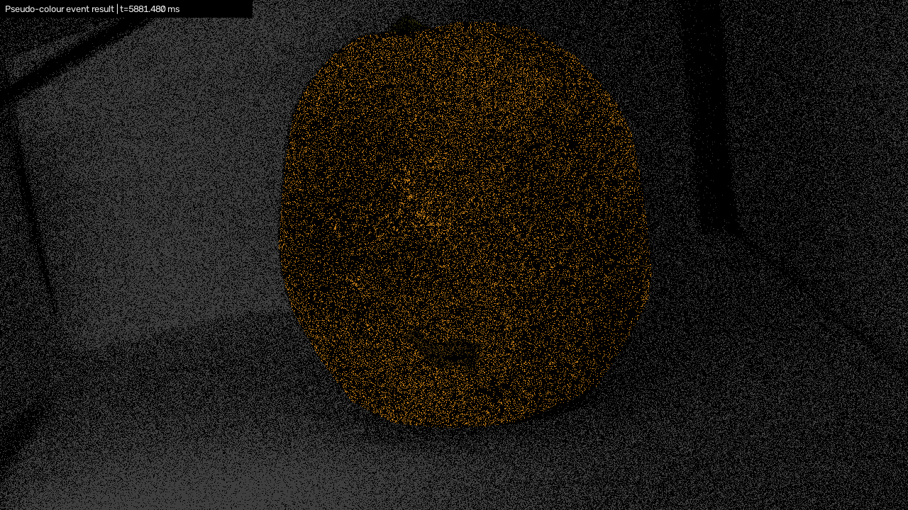
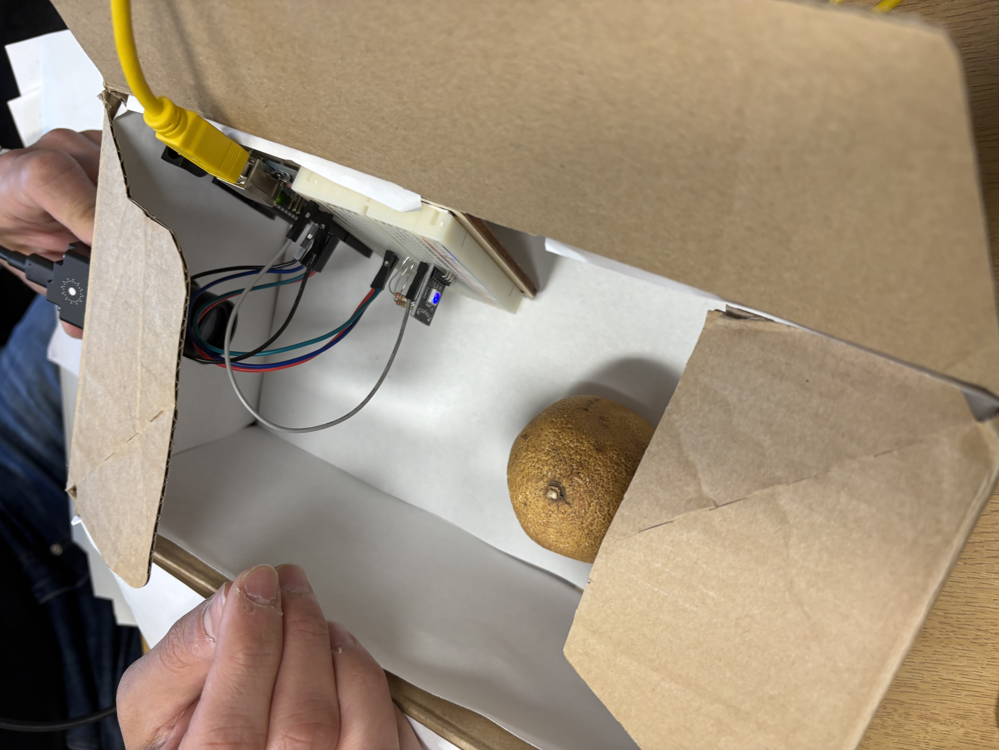
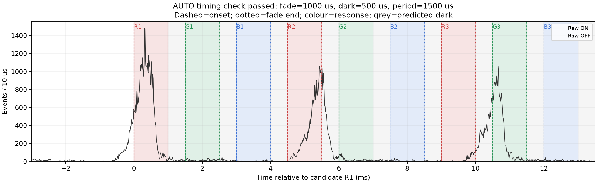
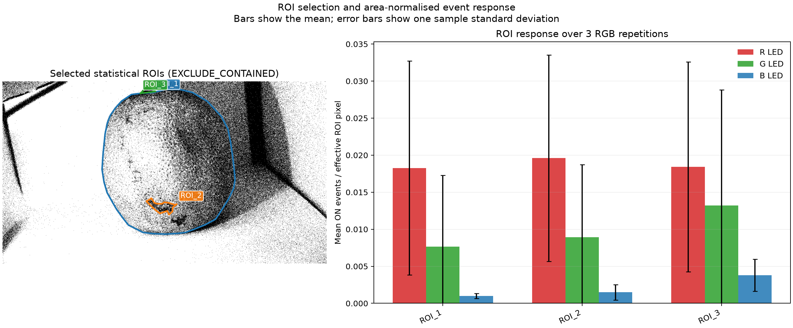
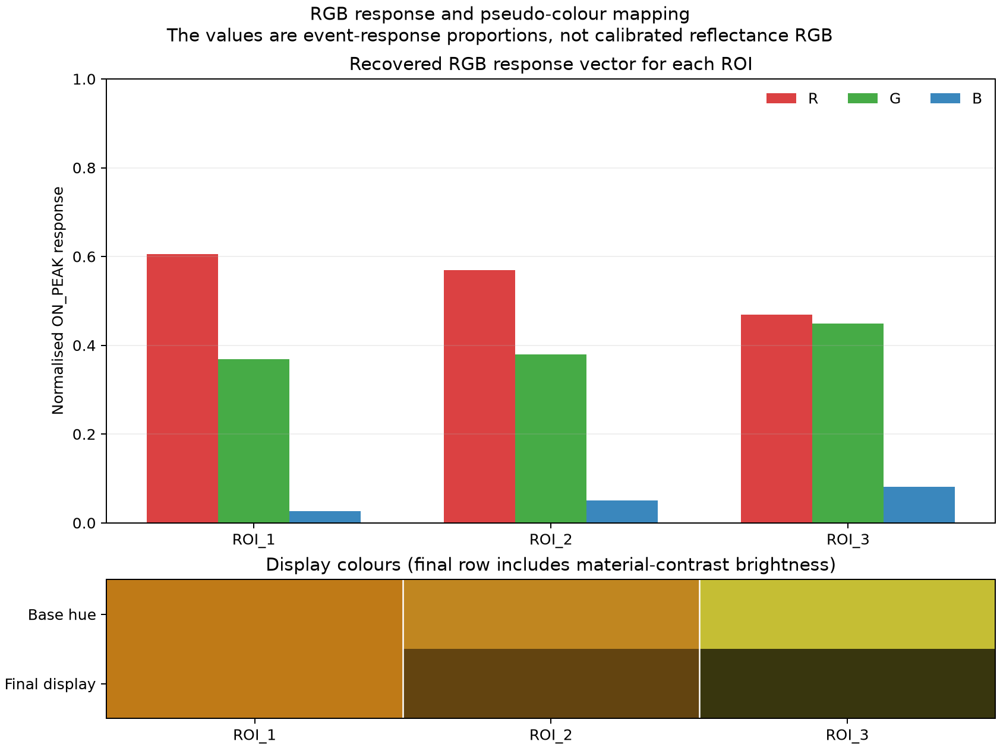

# Event-Based Colour Response Analysis and Pseudo-Colour Reconstruction

This repository documents my 2026 summer research project at the **University of Manchester**, focusing on colour-response analysis and pseudo-colour reconstruction using a monochrome event camera under sequential RGB illumination.

The project investigates whether relative colour information can be extracted from asynchronous event measurements by analysing the sensor response to controlled **red, green, and blue illumination**.

The work covers event-stream decoding, temporal synchronisation, ROI-based event-response analysis, RGB response estimation, and pseudo-colour visualisation.

---

## Project Demo

<p align="center">
  
</p>

The animation above shows an example of the final pseudo-colour event output.

Spatial and temporal information is derived from active event pixels, while colour is assigned according to the relative RGB response measured within selected regions of interest.

The current output should be interpreted as an **ROI-level pseudo-colour representation**, rather than a fully calibrated RGB reconstruction.

---

## Overview

Conventional frame-based cameras capture complete images at fixed time intervals.

In contrast, an **event camera** records changes in logarithmic brightness asynchronously. Each pixel independently generates an event when the local brightness change exceeds a predefined threshold.

An event can be represented as:

```text
e = (x, y, t, p)
```

where:

- `x, y` represent the pixel coordinates,
- `t` represents the timestamp,
- `p` represents the event polarity.

This sensing principle provides several advantages:

- high temporal resolution,
- low latency,
- high dynamic range,
- reduced motion blur,
- sparse data representation.

However, a monochrome event camera does not directly provide RGB colour information.

This project explores whether relative colour information can be inferred by illuminating the scene sequentially with **red, green, and blue light** and analysing the corresponding event responses.

The overall processing pipeline is:

```text
Sequential RGB Illumination
          ↓
Monochrome Event Camera
          ↓
Event Stream Recording
          ↓
DAT Event Decoding
          ↓
Flash / Phase Detection
          ↓
Temporal Synchronisation
          ↓
ROI Event Response Extraction
          ↓
RGB Response Vector Estimation
          ↓
Pseudo-Colour Mapping
```

The current system should therefore be regarded as an experimental framework for analysing colour-related event responses rather than a fully calibrated RGB reconstruction system.

---

## Research Questions

This project investigates the following questions:

1. How does a monochrome event camera respond to sequential red, green, and blue illumination?

2. Can event density measured under different illumination colours be used to estimate a relative RGB response?

3. How can the RGB illumination sequence be reliably synchronised with an asynchronous event stream?

4. How do ON and OFF events behave during controlled illumination changes?

5. What factors limit reliable colour reconstruction using event-camera measurements alone?

6. How could this approach be extended toward multimodal perception using event cameras, conventional RGB cameras, and other sensing modalities?

---

## Experimental Setup

The experimental system consists of:

- **Event Camera:** Prophesee EVK4 monochrome event camera
- **Resolution:** 1280 × 720
- **Illumination:** Sequential red, green, and blue light
- **Illumination Control:** Arduino-based control
- **Event Representation:** `(x, y, t, p)`
- **Main Processing Language:** Python
- **Core Libraries:** NumPy and OpenCV

<p align="center">
  
</p>

The RGB illumination sequence is repeated over multiple cycles.

During each illumination stage, the asynchronous response of the event camera is recorded.

Selected regions of interest are then analysed to compare their relative responses under red, green, and blue illumination.

---

# Methodology

## 1. Event Stream Decoding

The event-camera recordings are stored as Prophesee-style DAT files.

A Python processing pipeline was developed to decode the asynchronous event stream and extract:

- pixel coordinates,
- timestamps,
- event polarity.

The basic event representation is:

```text
Event = (x, y, timestamp, polarity)
```

Large recordings are processed in chunks to reduce memory requirements and enable efficient analysis of long event sequences.

The decoded events form the basis for all subsequent temporal and spatial processing.

---

## 2. Temporal Event Accumulation

Although an event camera operates asynchronously, short temporal windows can be used to accumulate events for analysis and visualisation.

For a selected interval:

```text
[t_start, t_end]
```

events within the interval are extracted and accumulated according to their spatial coordinates and polarity.

This makes it possible to create temporary event representations while retaining the original asynchronous event stream for quantitative analysis.

---

## 3. Flash Detection

One of the main challenges in the experiment is identifying when the red, green, and blue illumination stages occur within the event stream.

An initial approach attempted to locate each illumination stage independently by selecting the time windows containing the largest number of events.

However, this method was found to be unreliable.

PWM-controlled illumination can generate several strong event bursts within a single illumination stage.

Therefore:

```text
Maximum event count ≠ illumination onset
```

The strongest event peak does not necessarily correspond to the actual beginning of the physical illumination stage.

This observation motivated the development of a more robust temporal synchronisation strategy.

---

## 4. Temporal Synchronisation

Instead of independently detecting every RGB peak, the processing pipeline first identifies the beginning of the first red illumination stage.

<p align="center">
  
</p>

The initial illumination transition is detected by identifying a change from relatively low event activity to strong ON-event activity.

Event activity from multiple spatial regions can be considered together to reduce the influence of local noise.

Once the first red illumination stage is located, subsequent RGB response windows are predicted according to the known periodic timing of the illumination system.

In the current experiment, the measured RGB illumination timing is approximately:

```text
1.268 s
```

between corresponding stages of the repeated illumination sequence.

This phase-based strategy provides more consistent temporal alignment than independently selecting local event maxima.

### Key Observation

The experiment showed that:

> **Independent peak detection can incorrectly select PWM-induced event bursts rather than the true illumination transition.**

The subsequent RGB measurement windows are therefore phase-locked relative to the first detected illumination stage.

---

## 5. Region-of-Interest Analysis

Polygonal **regions of interest (ROIs)** are selected from the recorded scene.

For each ROI, event activity is measured during the corresponding red, green, and blue illumination stages.

The analysis includes:

- ON-event count,
- OFF-event count,
- total event count,
- ROI area,
- area-normalised event density.

<p align="center">
  
</p>

Because different ROIs may contain different numbers of pixels, raw event counts cannot always be compared directly.

An area-normalised response is therefore calculated as:

```text
Event Density = Number of Events / ROI Area
```

This enables more meaningful comparison between different surfaces or regions.

---

## 6. RGB Response Estimation

For each ROI, event responses measured under red, green, and blue illumination are combined into a relative RGB response vector.

The response can be represented as:

```text
RGB Response = [E_R, E_G, E_B]
```

where:

- `E_R` represents the event response under red illumination,
- `E_G` represents the event response under green illumination,
- `E_B` represents the event response under blue illumination.

The response vector can then be normalised:

```text
RGB_normalised =
[E_R, E_G, E_B] / max(E_R, E_G, E_B)
```

<p align="center">
  
</p>

The resulting vector describes the **relative response of the complete event-camera system** to the three illumination channels.

These values should not be interpreted as conventional calibrated RGB pixel intensities.

Instead, they represent relative colour-related responses under the current experimental conditions.

---

## 7. ON and OFF Event Analysis

Both ON and OFF events were investigated during the experiments.

An ON event is generally produced when the logarithmic brightness observed by a pixel increases sufficiently.

An OFF event is generally produced when the logarithmic brightness decreases sufficiently.

However, the measured ON/OFF response depends on several factors:

- the previous illumination state,
- the direction of the illumination transition,
- PWM timing,
- surface reflectance,
- local contrast,
- sensor thresholds,
- motion,
- noise.

Therefore:

```text
ON/OFF Event Count ≠ Absolute Optical Intensity
```

The current method consequently focuses on relative event responses under controlled illumination rather than directly interpreting event counts as RGB intensity values.

---

## 8. Pseudo-Colour Reconstruction

After estimating the relative RGB response of each ROI, the response is mapped back onto active event pixels.

The resulting representation combines:

```text
Event-camera spatial information
            +
Event-camera temporal information
            +
ROI-level RGB response estimate
```

to generate a pseudo-colour event output.

<p align="center">
  
</p>

Spatial information continues to come directly from active event pixels.

Colour information is assigned according to the relative RGB response measured for the corresponding ROI.

The current output should therefore be interpreted as:

> **ROI-level pseudo-colour reconstruction based on relative event responses under sequential RGB illumination.**

It is not equivalent to conventional RGB video reconstruction.

---

# Key Findings

## 1. Maximum Event Count Is Not a Reliable Illumination Trigger

PWM-controlled illumination can produce multiple strong event bursts within one RGB illumination stage.

Therefore, independently searching for the largest event-count peak can lead to incorrect temporal alignment.

This makes illumination timing one of the most important components of the processing pipeline.

---

## 2. Temporal Synchronisation Is Critical

Event cameras respond strongly to rapid brightness transitions.

Even relatively small timing errors can significantly alter the number of events measured inside a short response window.

Reliable synchronisation between the illumination system and the event stream is therefore essential for consistent RGB-response analysis.

---

## 3. Different Surfaces Produce Different RGB Responses

Selected surfaces generate different relative responses under red, green, and blue illumination.

The measured response is influenced by the interaction between:

```text
Illumination Spectrum
        ×
Surface Reflectance
        ×
Sensor Spectral Response
```

This suggests that colour-related information can be present in the event response even when the sensor itself is monochrome.

---

## 4. Event Count Is Not Equivalent to RGB Intensity

An event camera measures changes in logarithmic brightness rather than absolute optical intensity.

Therefore:

```text
Event Count ≠ Absolute RGB Intensity
```

The measured response is affected by:

- sensor contrast threshold,
- illumination intensity,
- illumination timing,
- previous illumination state,
- surface reflectance,
- motion,
- local scene structure,
- noise.

For this reason, direct conversion from event count to physically accurate RGB intensity is not possible without additional modelling and calibration.

---

## 5. Relative Colour Information Can Still Be Extracted

Although calibrated RGB reconstruction cannot be obtained directly from event counts alone, controlled sequential RGB illumination enables useful **relative colour-response information** to be estimated.

These responses can be used to generate an ROI-level pseudo-colour representation of the event stream.

---

# Limitations

## Illumination Calibration

The red, green, and blue light sources may not produce identical optical power.

Differences in event responses may therefore be caused partly by differences in LED intensity rather than surface reflectance alone.

---

## Sensor Spectral Sensitivity

The monochrome event sensor may have different sensitivities at different wavelengths.

Quantitative colour reconstruction would require a calibrated model of the sensor's spectral response.

---

## Event Thresholds

Events are generated only when the change in logarithmic brightness exceeds the internal contrast threshold of the sensor.

Consequently, event density is not linearly proportional to absolute optical intensity.

---

## PWM Modulation

PWM-driven illumination introduces additional brightness transitions.

These transitions generate additional events and can make accurate temporal alignment more difficult.

---

## Motion

Object motion or camera motion also generates events.

In a dynamic environment, the measured event stream therefore contains a mixture of:

```text
Illumination-induced events
            +
Motion-induced events
```

Separating these two sources remains an important challenge.

---

## ROI-Level Estimation

The current implementation primarily estimates colour responses at the ROI level.

A more advanced system could investigate:

- local adaptive estimation,
- dense spatial estimation,
- pixel-level spectral response modelling,
- learning-based reconstruction.

---

# Future Work

## 1. Hardware Synchronisation

A direct synchronisation signal between the illumination controller and the event-camera recording system could provide precise illumination timestamps.

This would significantly reduce uncertainty during temporal alignment.

---

## 2. Illumination Calibration

Future experiments could measure the optical output of each RGB illumination channel.

This would help distinguish differences caused by:

- LED intensity,
- surface reflectance,
- sensor sensitivity.

---

## 3. Sensor Spectral Calibration

The wavelength-dependent response of the event sensor could be characterised experimentally.

A calibrated spectral sensitivity model could then be included in the colour estimation process.

---

## 4. RGB Camera Ground Truth

A conventional RGB camera could be added to the experimental system to provide reference colour measurements.

The system could then compare:

```text
Event-derived colour estimate
            ↓
RGB camera ground truth
```

This would enable quantitative evaluation of reconstruction performance.

Possible metrics could include:

- RGB error,
- colour distance,
- reconstruction consistency,
- confusion between different surface colours.

---

## 5. Event + RGB Sensor Fusion

A longer-term extension is to combine the complementary properties of event cameras and conventional frame-based RGB cameras.

An event camera provides:

- high temporal resolution,
- low latency,
- reduced motion blur,
- high dynamic range.

An RGB camera provides:

- absolute intensity information,
- conventional colour information,
- dense spatial appearance.

Combining these two modalities could support more robust perception in challenging and highly dynamic environments.

---

## 6. Event + RGB + LiDAR Perception

The project could also be extended toward multimodal robotic perception by combining:

```text
Event Camera
     +
RGB Camera
     +
LiDAR
```

Such a system could exploit:

- temporal information from event cameras,
- appearance and colour information from RGB cameras,
- depth and geometric information from LiDAR.

This direction is particularly relevant to robotic perception and autonomous systems.

---

## 7. Motion Compensation

Future work could investigate:

- event-based optical flow,
- feature tracking,
- motion estimation,
- object tracking,

to separate motion-generated events from illumination-generated events.

This would be necessary for extending the current controlled experiment toward real-world dynamic scenes.

---

# Repository Structure

The current and planned repository structure is:

```text
event-camera-colour-reconstruction/
│
├── README.md
├── .gitignore
│
├── requirements.txt
│
├── results/
│   │
│   ├── figures/
│   │   ├── experimental_setup.JPG
│   │   ├── flash_detection.png
│   │   ├── roi_response.png
│   │   └── rgb_response.png
│   │
│   └── demos/
│       └── pseudo_colour_result.gif
│
├── src/
│   ├── dat_decoder.py
│   ├── flash_detection.py
│   ├── temporal_alignment.py
│   ├── roi_analysis.py
│   └── colour_mapping.py
│
├── experiments/
│   └── experimental analysis and configuration
│
└── docs/
    └── technical_report.pdf
```

The source-code structure will continue to be organised as the experimental code is cleaned and documented for public release.

---

# Software

The project primarily uses:

- **Python**
- **NumPy**
- **OpenCV**
- **Matplotlib**

Additional dependencies will be listed in:

```text
requirements.txt
```

---

# Data Availability

The original event-camera recordings are not included in this public repository because of their large file size and data-sharing considerations.

Where appropriate, small example recordings may be added for demonstration or reproducibility.

No confidential, proprietary, or internally restricted research data are intended to be included in this repository.

---

# Technical Report

A detailed technical report describing the:

- experimental design,
- event-camera processing pipeline,
- illumination synchronisation strategy,
- ROI analysis,
- RGB response estimation,
- pseudo-colour reconstruction,
- experimental observations,
- limitations,
- future work,

will be provided under:

```text
docs/technical_report.pdf
```

---

# Project Context

This work was conducted during a **2026 summer research project at the University of Manchester**.

The project forms part of my broader research interests in:

- Event-Based Vision
- Computer Vision
- Robotic Perception
- Multimodal Sensor Fusion
- LiDAR Perception
- Low-Latency Visual Sensing
- Autonomous Systems

---

# Author

**Shize Yang**

BEng (Hons) Electronic Engineering  
University of Manchester

Research interests:

**Event-Based Vision | Computer Vision | Robotic Perception | Sensor Fusion | Autonomous Systems**

GitHub: [Bestzivvv](https://github.com/Bestzivvv)

LinkedIn: [Ziv Yang](https://www.linkedin.com/in/ziv-yang-8b0aa5349)

---

# Citation

If you use or refer to this project, please cite:

```bibtex
@misc{yang2026eventcolour,
  author       = {Shize Yang},
  title        = {Event-Based Colour Response Analysis and Pseudo-Colour Reconstruction},
  year         = {2026},
  institution  = {University of Manchester},
  howpublished = {GitHub repository}
}
```

---

# Disclaimer

This repository documents an undergraduate research project and ongoing experimental work.

The pseudo-colour results represent **relative event responses under controlled sequential RGB illumination** and should not be interpreted as fully calibrated RGB reconstruction.
